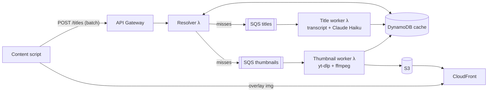

<p align="center">
  
</p>

<h1 align="center">Face Value</h1>

<p align="center">
  <strong>Take YouTube at face value.</strong><br />
  A browser extension that rewrites clickbait titles from the video's actual transcript,
  replaces engineered thumbnails with a real frame from the video, and removes Shorts
  entirely.
</p>

<p align="center">
  <a href="https://facethevalue.com">facethevalue.com</a> ·
  <a href="https://facethevalue.com/privacy">privacy</a> ·
  <a href="https://facethevalue.com/support">support the project</a>
</p>

---

Every thumbnail on YouTube is a bid for your attention, and the bids keep escalating.
Shocked faces, red arrows, capital letters, promises the video never keeps. Even honest
creators package good work this way, because the algorithm rewards whoever grabs
hardest. And when packaging individual videos isn't enough, there's Shorts: an infinite
scroll engineered for the dopamine hit itself, built to keep you swiping instead of
watching anything you actually chose.

Face Value takes those levers away. Titles say plainly what a video is, thumbnails are
just a frame from the video, and Shorts disappears from the site entirely. What's left
is a feed you choose from, not one that plays you.

- **Clean titles.** Rewritten from the video's transcript to say what it actually
  delivers. Hover any cleaned title to see the original.
- **Clean thumbnails.** A real frame extracted from the video itself.
- **Hide Shorts.** One toggle removes Shorts shelves, reels, and the sidebar button.
- **Channel exceptions.** Pause Face Value on channels you trust.
- **No account, no analytics.** The only thing sent off your device is the public video
  ids and titles on pages you view. Full details in the
  [privacy policy](https://facethevalue.com/privacy).

Live streams and search results are intentionally left untouched: searching is
deliberate navigation, and the feed is where the algorithm steers.

## How it works

The extension only ever does one cheap batched read; all expensive work happens
asynchronously behind a shared cache, so the whole system gets faster as more people
use it.



**Titles.** A worker verifies the video via YouTube's public oEmbed API, fetches the
transcript, and has a small LLM (Claude Haiku) rewrite the title to state what the
video actually contains. Grounding the rewrite in the transcript is the whole trick:
the new title describes the content, not a softened version of the creator's unrealistic title.

**Thumbnails.** A containerized worker fetches only the first ~0.2 MB of the video
stream (a Range request through a residential proxy; the whole pipeline costs
fractions of a cent per video), then ffmpeg scores every decodable frame on sharpness,
entropy, and luminance in one pass and keeps the best real frame. 720p output from a
fifth of a megabyte, independent of video length.

**Client.** The content script masks cards with a CSS gate injected at
`document_start`, so the clickbait version is never painted. Results overlay YouTube's
own elements, and uncached videos resolve in a few seconds via bounded polling. Every
card has a hard deadline, so the page never hangs on our backend.

## Repo layout

```
extensions/            MV3 extension (chrome / edge / firefox, built from shared/)
src/resolver/          API Lambda: batch cache lookup + queueing (TypeScript)
src/worker/            Title worker: oEmbed + transcript + LLM rewrite (TypeScript)
src/thumbnail-worker/  Frame extraction: yt-dlp + ffmpeg (Python, container image)
template.yaml          Complete AWS SAM stack (API, queues, tables, CDN, alarms)
tools/                 Local measurement harnesses (proxy cost, frame-vote A/B)
```

## Running your own

The backend is one SAM stack. You need an AWS account, Docker, and three SSM
SecureString parameters (Anthropic API key, transcript API key, residential proxy
URL); the header of `template.yaml` documents them.

```bash
sam build && sam deploy --guided
```

Point `API_BASE` in `extensions/shared/content.js` at your endpoint, run
`extensions/build.sh`, and load the browser folder of your choice as an unpacked
extension.

## License

[MIT](LICENSE). Fonts (Hanken Grotesk, Newsreader, JetBrains Mono) are bundled under
the SIL Open Font License. yt-dlp and ffmpeg are used server side under their
respective licenses.
